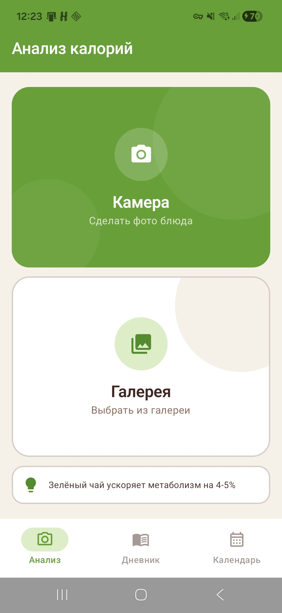
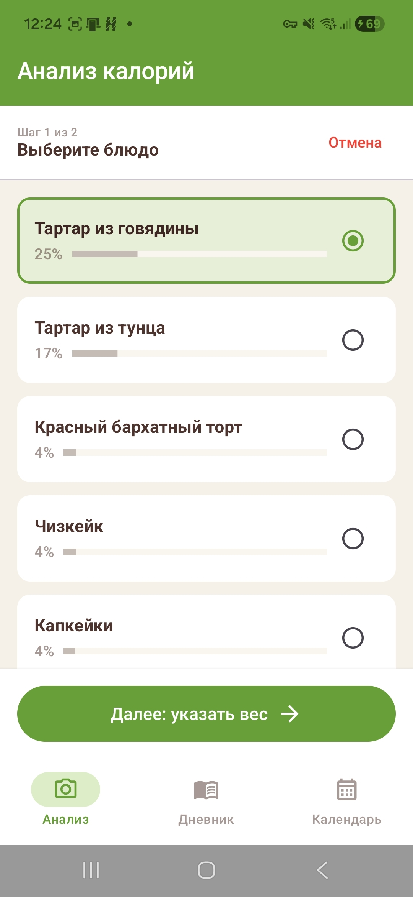
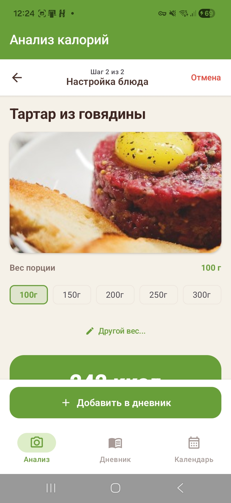
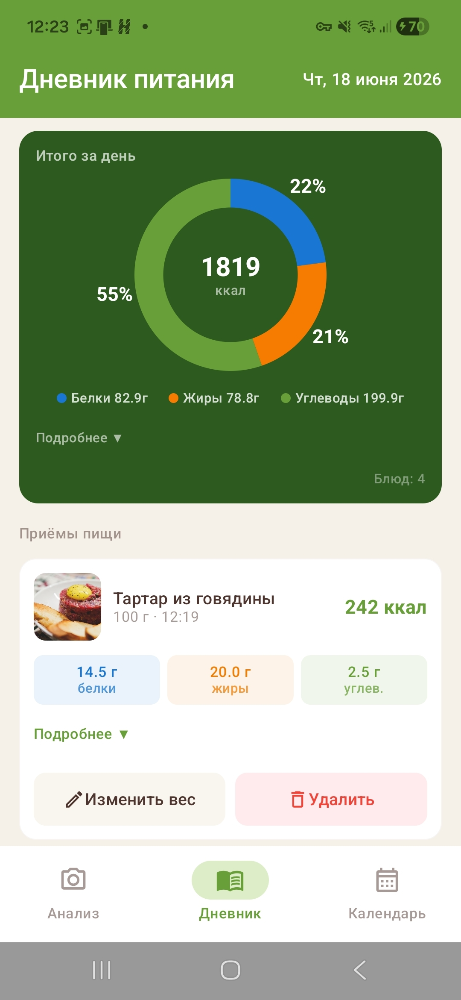
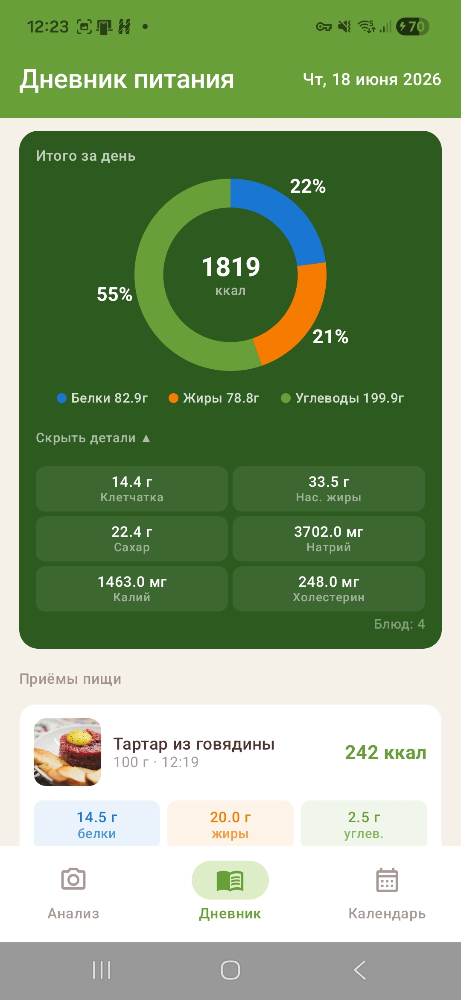
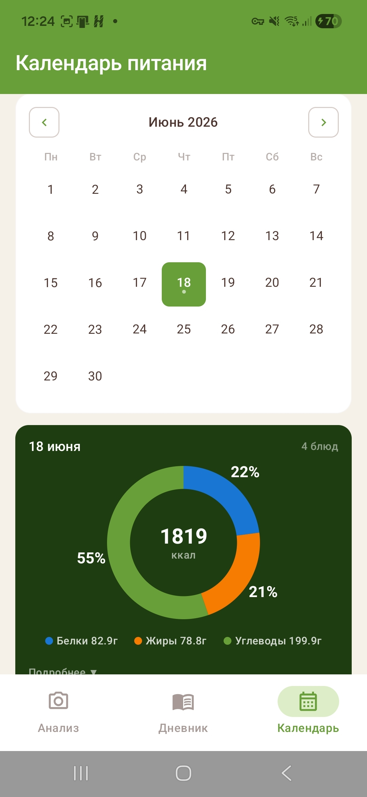

<div align="center">


<br/><br/>

# 🥗 Анализатор калорий

### Сфотографируй блюдо — узнай всё о его составе

Нейросеть распознаёт еду по фото, считает КБЖУ и ведёт дневник питания с визуальными отчётами.

<br/>

## 📱 Скриншоты

<div align="center">






</div>

<div align="center">

[📲 Скачать APK](https://github.com/Jeywoods/Calorie-Analysis/releases/download/v1.0.0/CalorieAnalysis.apk)

</div>

---

## ✨ Возможности

<table>
<tr>
<td width="50%">

**📸 Распознавание блюд**
Сфотографируйте еду или выберите из галереи — нейросеть Food101 определит блюдо за секунды.

**🔍 База данных**
Более 100 блюд с поиском по названию и мгновенной фильтрацией.

**⚖️ Полный нутриентный профиль**
Белки, жиры, углеводы, клетчатка, насыщенные жиры, сахар, натрий, калий, холестерин.

**📊 Визуализация**
Круговая диаграмма баланса макронутриентов для каждого приёма пищи.

</td>
<td width="50%">

**📅 Дневник питания**
Запись приёмов пищи по дням с возможностью редактировать вес порций.

**📈 Календарь питания**
Просмотр статистики за любой день встроенный календарь.

**💡 Советы по питанию**
Персонализированные рекомендации на главном экране.

</td>
</tr>
</table>

---

</div> <!-- Закрываем центрирующий div -->

<!-- ТАБЛИЦА ТЕХНОЛОГИЙ ВНЕ CENTER-БЛОКА, ПО ЛЕВОМУ КРАЮ -->
## 🛠 Технологии

| Категория | Стек |
|:----------|:-----|
| **Язык** | Kotlin |
| **UI** | Jetpack Compose + Material 3 |
| **DI** | Hilt |
| **База данных** | Room |
| **Нейросеть** | TensorFlow Lite (Food101) |
| **API** | Retrofit + OkHttp (CalorieNinjas) |
| **Изображения** | Coil |
| **Навигация** | Navigation Compose |
| **Асинхронность** | Kotlin Coroutines + Flow |

---

<div align="center"> <!-- Снова открываем для оставшейся центрированной части -->

## 🚀 Запуск

### Требования

- Android Studio Hedgehog или новее
- JDK 17+
- Android 7.0+ (API 24)

### Установка

**1. Клонируйте репозиторий**
```bash
git clone https://github.com/your-username/food-calorie-analyzer.git
cd food-calorie-analyzer
